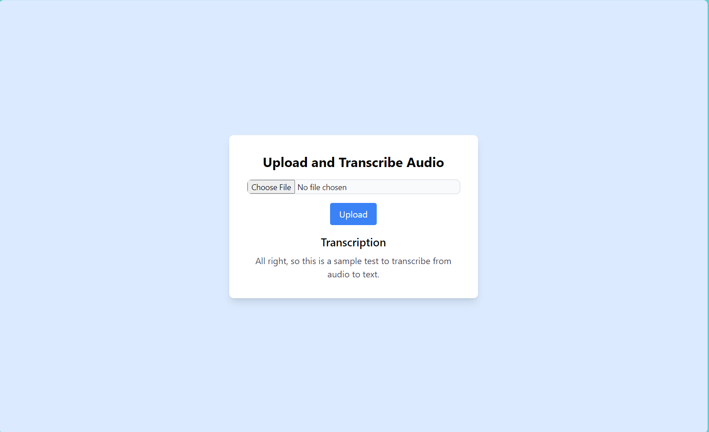

## Audio Transcription using AssemblyAI

This project demonstrates how to transcribe a WAV audio file into text using AssemblyAI SDK in Python.

### Description

The project leverages the AssemblyAI SDK to accurately convert a WAV audio file (including audio from videos) into text. It utilizes `AudioSegment` from `pydub` to convert uploaded files into WAV format, which are then stored in an `uploads` folder for subsequent processing. The WAV file is transcribed into text using the AssemblyAI SDK. Additionally, session management via Flask-Session is implemented for handling user sessions.

### Prerequisites

To run this project, ensure you have the following installed:

- Python 3.6 and above
- `ffmpeg` for handling audio conversion (installation details below)

### Setup

1. **Python Environment Setup:**
   - Create a virtual environment:
     ```bash
     python -m venv env
     ```
   - Activate the virtual environment:
     - On Windows:
       ```bash
       .\env\Scripts\activate
       ```
     - On macOS/Linux:
       ```bash
       source env/bin/activate
       ```

2. **Install Required Packages:**
   Install the necessary Python packages using `pip`:
   ```bash
   pip install -r requirements.txt

3. **Installing ffmpeg:**

    Download ffmpeg from ffmpeg.org/download.html.
    Add ffmpeg to your system's PATH or place it in a directory accessible from the command line (e.g., C:\ for Windows).

4. **Configuration:**

    Create a .env file in your project directory and add your AssemblyAI API key:

    ```ASSEMBLYAI_API_KEY=your_api_key_here```
    ```SECRET_KEY=secret_key_here```

5. Run the Application:

    Start the Flask application: ```python app.py```
        Access the application at http://127.0.0.1:5000.

### Usage

- Upload an audio file (supports WAV format).
- The file will be converted to WAV using pydub.
- AssemblyAI SDK transcribes the WAV file into text.
- Transcription results are displayed to the user.

### Demo Picture


This project provides a streamlined approach to audio transcription using modern Python libraries and APIs.


This project provides a streamlined approach to audio transcription using modern Python libraries and APIs.
